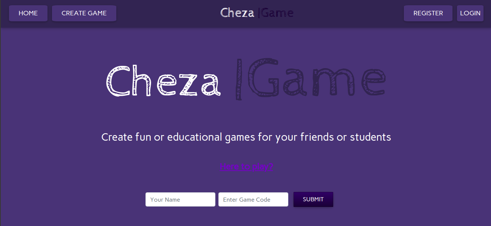
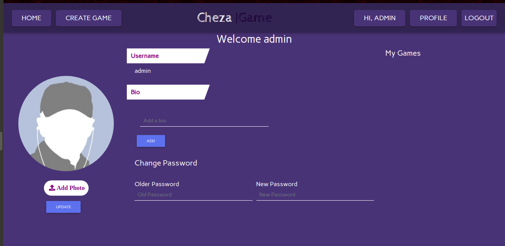

# Cheza Game

This is a game app that helps people test knowledge of friends,family,students e.t.c on diverse areas.

## Screenshots
* Homepage of the application


* Profile Page of the creator


## User Stories

- [x] Game creator can register for an account and log in into the application
- [x] Game creator can navigate to the create game page and create a  game name and description
- [x] Game creator can then add the questions and add choices for each of the questions
- [x] Game creator then shares the game password to the players
- [x] Player can enter a game by entering their name and password shared by the user and is directed to the game page where they then start the game
- [x] Player can answer the questions and submit the answers and view their results
## Getting Started

* Fork the repository on github and clone it on your local machine using the following command
```
git clone origin <link-to-the-site>
```
* Navigate to the project folder using the follwing command
```
cd QUIZ_APP
```
* Set up a postgresql database on your system and create a database for the application

* Create a virtual enviroment using the following command
```
python3.6 -m venv --without-pip virtual
```
* Navigate to the virtual enviroment in order to install the requirments for the application
```
source virtual/bin/activate
```
* Install the latest version of pip
```
curl https://bootstrap.pypa.io/get-pip.py | python
```
* Install the requirements
```
pip install -r requirements.txt
```

* Export the secret key and the database url to your environment
```
export SECRET_KEY=<your-secret-key>
```
```
export DATABASE_URL=<your-database-url>
```
* There are two ways to create database schema one is by migrations another through the shell to create the database through the shell navigate to the shell of your system
```
python3.6 manage.py shell
```
after navigation to the shell type
```
db
```
to check whether the database is properly linked with your application then type the following command to set up the schema
```
db.create_all()
```
to create the  database through migration type in the following command to initialise the migrations folder
```
python3.6 manage.py db init
```
to migrate the db type the following command
```
python3.6 manage.py db migrate -m "initial migration"
```
then you upgrade the database
```
python3.6 manage.py db upgrade
```

* You can now run the application using the following command
```
python3.6 manage.py server
```
## Technologys used 
1. Python Version 3.6
1. Flask Framework
1. Bootstrap
1. Css
1. Html
1. Javascript/JQuery

## Authors

* **Steve Mitto** - *Front-end and Back-end* - [SteveMitto](https://github.com/SteveMitto)
* **Esther Wachuka** - *Front-end and Back-end* - [wachucode](https://github.com/washucode)
* **Mugendi Njue** - *Back-end and Front-end* - [mugendinjue](https://github.com/mugendinjue)
* **Kevin Nyota** -*Database and Back-end* - [Nyota254](https://github.com/Nyota254)

## License

This project is licensed under the MIT License - see the [LICENSE.md](LICENSE.md) file for details

## Acknowledgments

* Moringa school for support through out the building of this project

* Inspiration
> “It is paradoxical that many educators and parents still differentiate between a time for learning and a time for play without seeing the vital connection between them.”
> -Leo F. Buscaglia

> Play is the only way the highest intelligence of humankind can unfold. 
> -Joseph Chilton Pearce